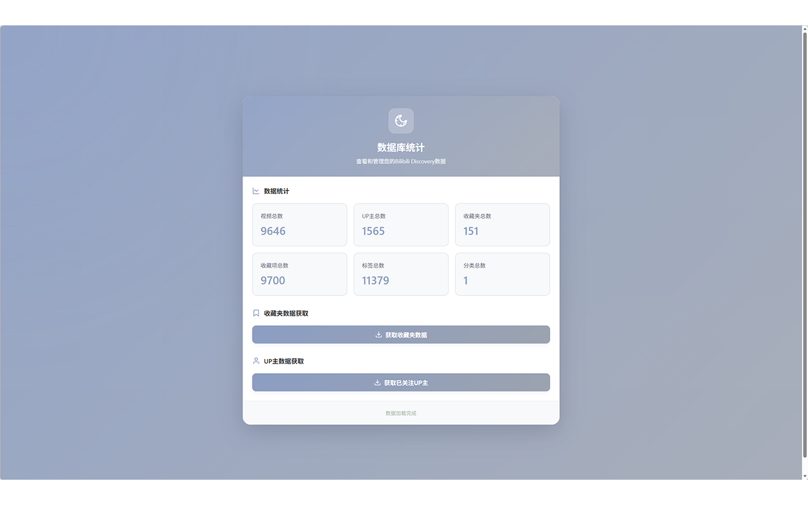
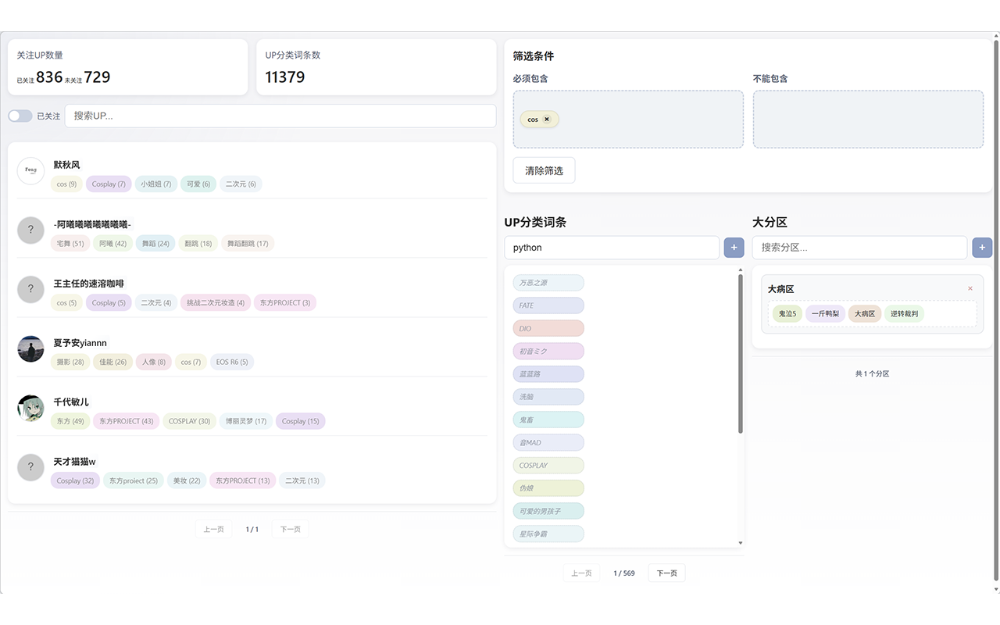

# Bilibili Discovery Engine

一个浏览器扩展，帮助您管理和探索B站内容，通过随机推荐UP主、标签分类、观看统计等方式发现和管理您感兴趣的UP主和视频。

## 主要功能

### 1. 自动数据同步
- 自动从B站拉取已关注UP主数据
- 自动同步收藏夹视频数据
- 无需手动操作，保持数据最新


### 2. 智能数据记录
- 用户观看视频时无感知记录相关数据
- 自动记录UP主信息（名称、头像等）
- 自动记录视频信息（标题、标签、时长等）
- 自动记录观看信息（观看时长、观看进度等）

### 3. UP主搜索与管理
- 支持基于UP主名称搜索
- 支持基于标签筛选
- 支持基于关注状态过滤
- 多条件组合搜索，快速找到目标UP主

### 4. 视频搜索与筛选
- 支持基于视频标题搜索
- 支持基于UP主名称筛选
- 支持基于收藏夹筛选
- 支持基于视频标签筛选
- 多条件组合搜索，快速找到目标视频


## 安装方法

### Chrome/Edge浏览器

1. 下载最新发布的 `.zip` 文件
2. 打开浏览器，访问 `chrome://extensions/` 或 `edge://extensions/`
3. 开启右上角的"开发者模式"
4. 解压 `.zip` 文件，将解压后的文件夹拖拽到扩展页面
5. 确认安装

### Firefox浏览器

1. 下载最新发布的 `.zip` 文件
2. 打开浏览器，访问 `about:addons`
3. 点击右上角的齿轮图标，选择"安装附加组件从文件"
4. 选择下载的 `.zip` 文件
5. 确认安装

### 开发者安装

从源码安装：

```bash
# 克隆仓库
git clone git@github.com:hakureireimuyo/bilibili_discovery.git
cd bilibili_discovery

# 安装依赖
npm install

# 构建项目
npm run build

# 在浏览器中加载 dist/extension 目录
```

## 使用方法

### 初始设置

1. **设置B站用户ID**
   - 点击浏览器工具栏中的插件图标
   - 在弹出的窗口中输入您的B站用户ID
   - 点击"保存设置"

2. **配置AI接口（用于智能分类）**
   - 点击插件图标
   - 点击"设置"按钮
   - 在设置页面中配置以下信息：
     - API密钥：输入您的DeepSeek或其他兼容OpenAI规范的API密钥
     - API地址：默认为DeepSeek API地址，可自定义
     - 模型名称：默认为deepseek-chat，可自定义
   - 点击"保存设置"

### 更新关注列表

1. 点击插件图标打开弹窗
2. 点击"更新关注列表"按钮
3. 等待更新完成

### 智能分类UP主

1. 确保已配置AI接口（见初始设置）
2. 点击插件图标
3. 点击"开始分类"按钮
4. 系统会自动为所有关注的UP主进行分类
5. 分类完成后，可在统计页面查看结果

**注意**：
- 分类过程可能需要较长时间，取决于UP主数量和API响应速度
- 建议在非高峰时段进行批量分类
- 分类结果会自动保存，下次使用时无需重新分类


## 开发

### 项目结构

```
bilibili_discovery/
├── src/                    # TypeScript 源码
│   ├── api/               # B站API接口层
│   │   ├── README.md
│   │   ├── bili-api.ts    # B站接口主封装
│   │   ├── types.ts       # API返回数据类型定义
│   │   ├── request.ts     # 请求工具
│   │   ├── video.ts       # 视频相关API
│   │   ├── user.ts        # 用户相关API
│   │   ├── favorite.ts    # 收藏夹相关API
│   │   ├── search.ts      # 搜索相关API
│   │   ├── comment.ts     # 评论相关API
│   │   ├── danmaku.ts     # 弹幕相关API
│   │   ├── region.ts      # 分区相关API
│   │   └── wbi.ts         # WBI签名生成
│   │
│   ├── background/        # 后台服务层
│   │   ├── README.md
│   │   └── service-worker.ts  # Service Worker入口
│   │
│   ├── content/           # 内容脚本层
│   │   ├── README.md
│   │   ├── types.ts       # 类型定义
│   │   ├── index.ts       # 主入口
│   │   ├── triggers/      # 触发器层
│   │   │   ├── video-trigger.ts
│   │   │   ├── follow-trigger.ts
│   │   │   └── favorite-trigger.ts
│   │   ├── collectors/    # 收集器层
│   │   │   ├── video-collector.ts
│   │   │   └── up-collector.ts
│   │   └── forwarder/     # 转发层
│   │       └── data-forwarder.ts
│   │
│   ├── database/          # 数据库层
│   │   ├── README.md
│   │   ├── types/         # 数据类型定义
│   │   ├── indexeddb/     # IndexedDB基础设施
│   │   ├── implementations/  # 数据访问实现
│   │   ├── repositories/  # Repository层
│   │   ├── query-server/  # 查询服务器
│   │   │   ├── cache/     # 缓存层
│   │   │   ├── query/     # 查询层
│   │   │   └── book/      # 书管理层
│   │   └── app-state.ts   # 应用状态管理
│   │
│   ├── engine/            # 业务计算层
│   │   ├── README.md
│   │   ├── llm-client.ts  # LLM调用封装
│   │   ├── classifier.ts  # 分类逻辑
│   │   └── recommender.ts  # 推荐逻辑
│   │
│   ├── renderer/          # 渲染层
│   │   ├── README.md
│   │   ├── 使用手册.md
│   │   ├── 生命周期对接.md
│   │   ├── RenderBook.ts  # 渲染书实现
│   │   ├── RenderList.ts  # 渲染列表实现
│   │   ├── types.ts       # 类型定义
│   │   └── index.ts       # 模块入口
│   │
│   ├── themes/            # 主题管理
│   │   ├── README.md
│   │   ├── types.ts       # 类型定义
│   │   ├── theme-configs.ts  # 主题配置
│   │   ├── theme-manager.ts   # 主题管理器
│   │   ├── theme-variables.ts # CSS变量
│   │   └── page-theme.ts  # 页面主题
│   │
│   ├── ui/                # UI层
│   │   ├── README.md
│   │   ├── popup/         # 弹窗页面
│   │   ├── options/       # 设置页面
│   │   ├── stats/         # 统计页面
│   │   ├── watch-stats/   # 观看统计页面
│   │   ├── favorites/     # 收藏夹页面
│   │   ├── theme-settings/  # 主题设置页面
│   │   ├── theme-example/   # 主题示例页面
│   │   ├── test-tools/     # 测试工具页面
│   │   ├── database-stats/  # 数据库统计页面
│   │   └── shared/        # 共享组件
│   │
│   ├── icons/             # 图标资源
│   │   ├── README.md
│   │   ├── icon.svg
│   │   └── icon16.svg
│   │
│   └── utils/             # 工具函数
│       ├── dom-utils.ts
│       ├── drag-utils.ts
│       ├── image-compression.ts
│       ├── image-utils.ts
│       ├── logger.ts
│       ├── tag-utils.ts
│       └── url-builder.ts
│
├── docs/                  # 项目文档
│   ├── UI层架构设计规范.md
│   ├── ai生成代码规范.md
│   ├── webapi手册.md
│   ├── 主题页面开发规范.md
│   ├── 日志系统使用说明.md
│   ├── 未来更新功能目标.md
│   └── 查询架构设计规范.md
│
├── scripts/              # 构建脚本
│   ├── build-extension.js
│   ├── bundle-content-script.js
│   ├── generate-icons.html
│   ├── package-extension.js
│   ├── package-simple.js
│   ├── prebuild.js
│   ├── probe-arcopen.js
│   ├── probe-bili-api.js
│   ├── release.js
│   ├── run-db-tests.js
│   └── view-db.js
│
├── picture/              # 图片资源
├── config/               # 配置文件
├── CHANGELOG.md         # 版本历史
├── CONTRIBUTING.md      # 贡献指南
├── LICENSE             # 许可证
└── package.json
```

### 核心模块说明

#### 1. API层 (`src/api`)

负责封装与Bilibili相关的外部接口访问逻辑，主要职责包括：
- 统一管理请求入口、参数拼装与鉴权头
- 提供面向业务的API方法，如获取关注列表、UP信息、视频列表等
- 隔离外部接口细节，避免业务层直接拼接URL

**主要类型定义**：
- `BiliResponse<T>`：所有B站API的通用响应格式
- `UpInfo`/`FollowingUp`：UP主基础信息
- `VideoInfo`：视频基础信息
- `FavoriteFolderInfo`：收藏夹基础信息

#### 2. 后台服务层 (`src/background`)

存放扩展后台运行入口与后台生命周期相关代码：
- 启动service worker
- 注册消息监听、定时任务、后台能力入口
- 将后台主流程拆分到模块中实现

#### 3. 内容脚本层 (`src/content`)

采用三层架构设计，负责从B站页面收集数据：

**触发器层 (triggers)**：
- 决定何时触发数据收集
- 监听视频播放事件、关注/收藏按钮状态变化等

**收集器层 (collectors)**：
- 决定从页面收集什么数据
- 提取视频元数据、UP主信息等

**转发层 (forwarder)**：
- 统一的数据转发接口
- 将收集到的数据发送到后台处理

#### 4. 数据库层 (`src/database`)

采用分层架构设计，提供高性能的数据存储、查询和缓存能力：

**Repository层**：
- 数据访问、缓存管理、数据一致性保障
- 查询协调、数据转换

**Query-Server层**：
- Cache Layer：管理索引和完整数据的内存缓存
- Query Layer：执行查询逻辑
- Book Layer：管理查询结果和分页数据

**Implementations层**：
- 实现Repository接口
- 提供批量操作能力

#### 5. 业务计算层 (`src/engine`)

负责业务计算、分类与推荐等规则/算法层逻辑：
- 进行UP内容分类
- 调用LLM完成标签推断
- 基于兴趣分数、标签权重和视频信息做推荐

#### 6. 渲染层 (`src/renderer`)

介于数据层和UI层之间的中间层，负责将数据对象转换为网页元素：

**RenderBook**：
- 数据转换、分页显示、缓存管理

**RenderList**：
- 元素渲染、翻页交互、元素管理

#### 7. 主题管理 (`src/themes`)

集中式的主题管理系统：
- 支持多套主题配色（莫兰迪主题等）
- 动态主题切换
- CSS变量自动应用
- 主题变更通知机制

#### 8. UI层 (`src/ui`)

提供扩展内各个前端页面的实现：
- popup：浏览器工具栏弹出页
- options：扩展设置页
- stats：UP分类与标签管理页
- watch-stats：观看统计展示页
- favorites：收藏夹视频浏览与标签筛选页
- theme-settings：主题设置页面
- shared：跨页面复用的UI基础组件

### 可用命令

```bash
# 安装依赖
npm install

# 构建项目
npm run build

# 运行测试
npm run test

# 探测B站API
npm run probe:bili
```

## 权限说明

- `storage`：用于存储用户设置和API配置
- `tabs`：用于打开新标签页显示推荐内容
- `alarms`：用于定时更新数据
- `unlimitedStorage`：用于IndexedDB数据库存储（自动申请）

## 隐私说明

本扩展仅访问B站公开数据，不会收集或上传任何个人信息。

### 数据存储
- 所有数据均存储在本地浏览器中
- 使用IndexedDB存储结构化数据
- 使用chrome.storage存储用户设置
- 数据完全由用户控制，可随时清除

### 数据内容
- 关注的UP主列表
- 视频观看记录
- 标签分类信息
- 用户兴趣分析数据
- 笔记和知识库
- 不包含任何个人敏感信息

## 未来功能规划

### 🌟 个人兴趣星球
- 基于收集的tag信息展现个人兴趣星球
- 可视化展示兴趣分布和关联
- 发现潜在的兴趣领域
- 支持兴趣节点的层级展示
- 实时更新兴趣权重

### 🎯 智能推荐
- 基于观看历史的视频推荐
- 基于兴趣标签的UP主推荐
- 支持多平台内容推荐


### 📚 知识库管理
- 视频笔记管理
- 知识条目整理
- 笔记关联和检索
- AI 辅助笔记整理

### 🤖 LLM 对话
- 基于个人兴趣的对话
- 内容理解和推荐
- 智能问答

### 📊 高级分析
- 观看行为深度分析
- 兴趣趋势预测
- 内容质量评估

## 版本历史

### v2.1.0 (2024-03-XX)
- 🗄️ 切换为IndexedDB数据库，支持存储更多数据
- 🏗️ 重构数据结构，优化代码逻辑
- 🔧 优化监听观看视频的信息获取机制
- 🐛 修复无法获取未关注UP信息的问题
- ⚡ 实现标签权重系统，随观看视频增加标签权重
- 📦 完整重构数据库模块
  - 分离接口定义和实现
  - 支持多平台数据存储
  - 优化数据查询性能
  - 完善的类型定义
  - 支持分页查询
  - 支持批量操作
  - 完整的文档注释
- 🎨 新增主题管理系统
  - 支持莫兰迪主题（浅色/深色）
  - 动态主题切换
  - CSS变量自动应用
- 📊 实现渲染书和渲染列表系统
  - 数据与UI分离
  - 高效的分页管理
  - 智能缓存机制
- 🔧 重构内容脚本层
  - 采用三层架构（触发器、收集器、转发器）
  - 提高代码可维护性和可测试性

### v1.0.0 (2024-03-12)
- 🎉 首次正式发布
- ✨ 实现随机推荐UP主功能
- ✨ 实现智能分类功能
- ✨ 实现统计信息展示
- ✨ 实现标签筛选功能
- 🎨 优化UI设计
- 🎨 添加精美图标

详细版本历史请查看 [CHANGELOG.md](./CHANGELOG.md)

## 项目文档

项目包含详细的开发文档，位于 `docs/` 目录下：

- [UI层架构设计规范](./docs/UI层架构设计规范.md) - UI层的架构设计规范和最佳实践
- [AI生成代码规范](./docs/ai生成代码规范.md) - 使用AI生成代码时的规范和指导
- [WebAPI手册](./docs/webapi手册.md) - Web API的使用说明
- [主题页面开发规范](./docs/主题页面开发规范.md) - 主题页面的开发规范
- [日志系统使用说明](./docs/日志系统使用说明.md) - 日志系统的使用方法
- [未来更新功能目标](./docs/未来更新功能目标.md) - 项目未来的功能规划
- [查询架构设计规范](./docs/查询架构设计规范.md) - 数据库查询架构的设计说明

各模块的详细文档：
- [API层说明](./src/api/README.md) - B站API接口层的详细说明
- [后台服务层说明](./src/background/README.md) - 后台服务层的说明
- [内容脚本层说明](./src/content/README.md) - 内容脚本层的架构和使用说明
- [数据库层说明](./src/database/README.md) - 数据库层的详细使用指南
- [业务计算层说明](./src/engine/README.md) - 分类和推荐引擎的说明
- [渲染层说明](./src/renderer/README.md) - 渲染书和渲染列表的使用手册
- [主题管理说明](./src/themes/README.md) - 主题管理系统的详细文档
- [UI层说明](./src/ui/README.md) - UI层的结构和说明

## 贡献

欢迎提交 Issue 和 Pull Request！

## 许可证

Apache2.0 License

## 致谢

感谢所有使用和贡献本项目的用户！
