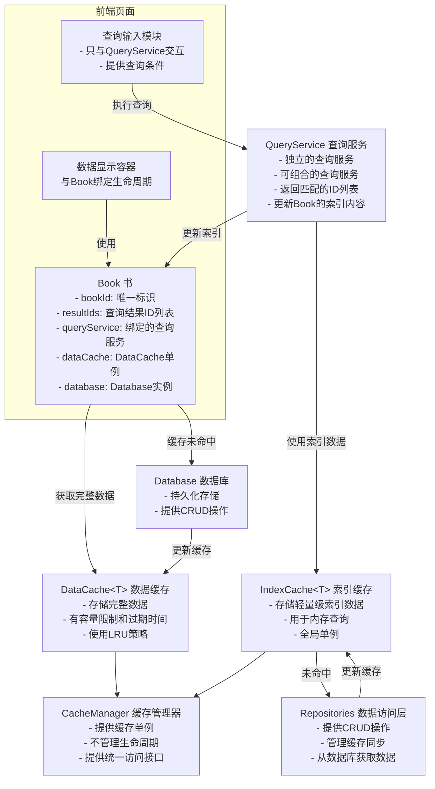

# Query-Server 架构说明

## 概述

Query-Server模块提供高性能的数据查询和分页管理功能，采用四层架构设计：

1. **数据缓存层（Cache Layer）**：管理索引和完整数据的内存缓存
2. **查询服务层（Query Layer）**：执行查询逻辑，返回结果ID列表
3. **书管理层（Book Layer）**：管理查询结果和分页数据
4. **数据访问层（Repositories Layer）**：封装数据库操作和缓存管理

### 架构设计原则

本架构遵循以下核心设计原则：

1. **查询与存储彻底解耦**：查询层不依赖数据库，数据库不参与复杂查询
2. **Cache成为查询引擎载体**：使用内存结构替代数据库查询能力，构建自建的内存查询引擎
3. **Repository成为唯一数据入口**：所有缓存操作必须通过Repository层，确保数据一致性
4. **职责单一化**：每个模块只负责自己的核心职责，避免职责过载
5. **工程可控性**：架构设计考虑长期可维护性和可扩展性

## 第一层：数据缓存层

### 缓存类型

#### 1. 索引缓存（IndexCache<T>）

存储轻量级索引数据，用于在内存中执行全量复杂条件查询：

**特性：**
- 存储用于查询的轻量级数据（如CreatorIndex、VideoIndex）
- 不包含过期时间，长期驻留内存
- **无容量限制**，不需要清理
- 支持批量操作
- 全局单例，相同数据类型唯一

**设计决策：**
- **全量驻留策略**：由于数据增长缓慢（一个用户可能十年也看不完十万条视频），且存储的是轻量级索引数据，因此采用全量驻留内存的策略
- **可控内存模型**：IndexCache中的数据结构受到严格约束，确保内存占用可控
  - 固定长度字段（id / number / enum）
  - 小字符串（<= 32 或 64 字符）
  - 小数组（<= 5 元素）
- **数据类型优化**：将字符串数组转换为数字数组（如tags: string[] → tagIds: number[]），进一步降低内存占用

**初始化机制：**
- 只在需要时从数据库拉取数据
- 前端调用查询服务时，检查索引缓存是否存在数据
- 不存在则从数据库全量拉取并建立索引缓存
- 如果程序运行但未使用任何查询，索引缓存不会拉取数据

**更新机制：**
- 只由 `src\database
epositories` 的实例进行更新
- 不会同步到数据库
- 不需要与数据库完全同步
- 重启后从数据库重建

**示例数据结构：**
```typescript
// CreatorIndex - 创作者索引
interface CreatorIndex {
  creatorId: string;
  name: string;
  tags: string[];
  isFollowing: boolean;
}

// VideoIndex - 视频索引
interface VideoIndex {
  videoId: string;
  platform: Platform;
  creatorId: string;
  title: string;
  duration: number;
  publishTime: number;
  tags: string[];
  isInvalid?: boolean;
}
```

#### 2. 数据缓存（DataCache<T>）

存储完整数据对象，有容量限制：

**特性：**
- 存储完整数据（如Creator、Video）
- 包含过期时间（默认1小时）
- 使用LRU策略管理容量
- 支持批量操作
- 全局单例，相同数据类型唯一

**容量管理：**
- 使用数量限制而非实际占用限制（数量计算更快，不需要十分准确）
- 不同数据类型的上限根据单条数据大小调整
- 数据占用内存大 → 上限少一些
- 数据占用内存小 → 上限多一些
- **最小支持50条数据**
- **最多支持1000条数据**

**更新机制：**
- 只由 `src\database
epositories` 的实例进行更新
- 不会同步到数据库
- 不需要与数据库完全同步
- 重启后从数据库重建

**示例数据结构：**
```typescript
// Creator - 完整创作者数据
interface Creator {
  creatorId: string;
  name: string;
  description?: string;
  avatar?: string;
  tagWeights: TagWeight[];
  isFollowing: 0 | 1;
  // ... 其他完整字段
}

// Video - 完整视频数据
interface Video {
  videoId: string;
  platform: Platform;
  creatorId: string;
  title: string;
  description?: string;
  cover?: string;
  duration: number;
  publishTime: number;
  tags: string[];
  isInvalid?: boolean;
  // ... 其他完整字段
}
```

好的,以下是修改后的TagCache说明和基于tag的搜索策略:

#### 3. 标签缓存（TagCache）
存储标签到索引数组(SortedArray)的映射，用于高效标签查询：

**核心设计理念：**
- 使用SortedArray替代Set，实现可预测的内存占用和高效的集合运算
- 标签映射存储的是索引而非完整ID，大幅减少内存消耗
- 支持增量更新，避免全量重建的开销
- 与IndexCache协同工作，先粗筛再精筛

**数据结构：**
```typescript
class TagCache {
  // 标签到索引数组的映射
  private tagMap: Map<string, number[]> // tagId → index[]（升序数组）
  
  // 全局索引映射（与IndexCache共享）
  private indexMap: Map<string, number> // id → index
  private reverseIndexMap: Map<number, string> // index → id
}

// 标签缓存条目
interface TagCacheEntry {
  tagId: string;            // 标签ID
  indices: number[];        // 索引数组（升序，无重复）
  lastUpdate: number;       // 最后更新时间
  totalCount: number;       // 总数据量
}
```

**内存特性：**
- 相比Set<string>，SortedArray<number>通常节省5~10倍内存
- 连续内存布局，极低开销
- 无重复，升序排列
- **不包含过期时间，长期驻留内存**
- **无容量限制，不需要清理**

**初始化机制：**
- 与IndexCache相同，只在需要时从数据库拉取数据
- 前端调用查询服务时，检查TagCache是否存在数据
- 不存在则从数据库全量拉取并建立TagCache
- 如果程序运行但未使用任何查询，TagCache不会拉取数据
- 初始化时建立全局索引映射（id ↔ index）

**更新机制：**
- 只由 `src\database\repositories` 的实例进行更新
- 不会同步到数据库
- 不需要与数据库完全同步
- 重启后从数据库重建
- 支持增量更新：
  - 新增视频：分配新索引，插入到相关标签的数组中
  - 删除视频：从相关标签的数组中移除索引
  - 修改标签：先移除旧标签的索引，再添加到新标签的数组中


### 缓存管理器（CacheManager）

**职责：**
- 仅提供不同数据类型的缓存单例
- 确保相同数据类型的缓存实例全局唯一
- 提供统一的缓存访问接口
- **不管理单例的生命周期**，仅作为单例提供方法的入口

**设计要点：**
- 使用单例模式
- 通过泛型确保类型安全
- 延迟初始化缓存实例
- 支持缓存统计和监控

**缓存类型来源：**
- 所有数据类型定义在 `src\database	ypes` 中
- 所有缓存实例基于这些类型创建
- 确保类型的一致性和可追溯性

## 第二层：查询服务层

### 查询服务设计

查询层必须依赖Cache获取数据，这是必备的前提。为了保持代码实现的简洁性，查询层被拆分为纯函数和调度层两部分：

**纯函数（Engine）：**
- 负责执行具体的查询逻辑
- 不依赖任何状态
- 可独立测试
- 示例：
  ```typescript
  function filterByTitle(indexes, keyword): string[]
  function filterByTags(indexes, tagExpr): string[]
  ```

**调度层（Executor）：**
- 薄封装，负责协调查询流程
- 持有Cache引用
- 调用纯函数执行查询
- 示例：
  ```typescript
  class QueryExecutor {
    constructor(private cache: IndexCache) {}
    
    run(condition): string[] {
      const indexes = this.cache.getAll()
      let ids = indexes
      
      if (condition.keyword) {
        ids = filterByTitle(ids, condition.keyword)
      }
      
      if (condition.tags) {
        ids = filterByTags(ids, condition.tags)
      }
      
      return ids.map(i => i.id)
    }
  }
  ```

**设计优势：**
- 不引入新的抽象层级
- 复杂度几乎不变
- 可测试性提升
- 可替换性提升

### 查询服务规范

所有查询服务必须遵守以下规范：

**输入规范：**
```typescript
interface QueryInput<T> {
  indexes: T[];              // 索引数据列表
  condition: QueryCondition; // 查询条件
  cacheKey?: string;         // 可选的缓存键
}
```

**输出规范：**
```typescript
interface QueryOutput {
  matchedIds: string[];      // 匹配的ID列表
  stats?: QueryStats;        // 查询统计信息（可选）
}
```

### 查询服务类型

#### 1. 基础查询服务

每个基础查询服务专注于单一查询维度：

**名称/标题查询服务：**
- Creator: 按创作者名称匹配
- Video: 按视频标题匹配
- 逻辑相同，处理对象不同

**核心算法：**
```typescript
// 交集（AND操作）- 双指针线性扫描
function intersect(a: number[], b: number[]): number[] {
  const result: number[] = [];
  let i = 0, j = 0;
  while (i < a.length && j < b.length) {
    if (a[i] === b[j]) {
      result.push(a[i]);
      i++;
      j++;
    } else if (a[i] < b[j]) {
      i++;
    } else {
      j++;
    }
  }
  return result;
}

// 并集（OR操作）- 类似merge排序
function union(a: number[], b: number[]): number[] {
  const result: number[] = [];
  let i = 0, j = 0;
  while (i < a.length || j < b.length) {
    if (j >= b.length || (i < a.length && a[i] < b[j])) {
      if (result.length === 0 || result[result.length - 1] !== a[i]) {
        result.push(a[i]);
      }
      i++;
    } else if (i >= a.length || (j < b.length && a[i] > b[j])) {
      if (result.length === 0 || result[result.length - 1] !== b[j]) {
        result.push(b[j]);
      }
      j++;
    } else {
      // a[i] === b[j]
      if (result.length === 0 || result[result.length - 1] !== a[i]) {
        result.push(a[i]);
      }
      i++;
      j++;
    }
  }
  return result;
}

// 差集（NOT操作）
function subtract(a: number[], b: number[]): number[] {
  const result: number[] = [];
  let i = 0, j = 0;
  while (i < a.length) {
    if (j >= b.length || a[i] < b[j]) {
      result.push(a[i]);
      i++;
    } else if (a[i] === b[j]) {
      i++;
      j++;
    } else {
      j++;
    }
  }
  return result;
}

// 插入到有序数组
function insertSorted(arr: number[], value: number): void {
  let left = 0, right = arr.length;
  while (left < right) {
    const mid = Math.floor((left + right) / 2);
    if (arr[mid] < value) {
      left = mid + 1;
    } else {
      right = mid;
    }
  }
  // 检查是否已存在
  if (left < arr.length && arr[left] === value) {
    return; // 已存在，不插入
  }
  arr.splice(left, 0, value);
}

// 从有序数组中移除
function removeFromArray(arr: number[], value: number): void {
  let left = 0, right = arr.length;
  while (left < right) {
    const mid = Math.floor((left + right) / 2);
    if (arr[mid] < value) {
      left = mid + 1;
    } else {
      right = mid;
    }
  }
  if (left < arr.length && arr[left] === value) {
    arr.splice(left, 1);
  }
}
```

**标签查询服务：**
- 支持AND、OR、NOT操作
- 可同时用于Creator和Video
- 使用TagFilterEngine实现
- 查询表达式结构：
  ```typescript
  type TagExpression = 
    | { type: 'AND', tagId: string }
    | { type: 'OR_GROUP', tagIds: string[] }
    | { type: 'NOT', tagId: string }
  ```
- 查询执行流程：
  1. TagCache执行集合运算 → index[]
  2. index[]转换为id[]
  3. IndexCache进一步过滤（title/creator）
  4. 返回结果
- 查询优化策略：
  1. 按最小集合优先：sort(tags by length asc)，减少计算量
  2. 提前终止：if result.length === 0: break
  3. NOT最后执行：A ∩ B ∩ C → 再减 D
- 表达式规范：AND为主结构，OR_GROUP为子表达式，NOT最后执行
  - 示例：tag1 AND tag2 AND (tag3 OR tag4) AND NOT tag5

**边界与限制：**
- index一旦分配，不可重排，否则所有TagCache失效
- 删除策略：逻辑删除或从数组中移除
- TagCache不存储对象，只存index（number）
- 与IndexCache协同：TagCache=粗筛（集合运算），IndexCache=精筛（字段匹配）


**关注状态查询服务：**
- 过滤已关注/未关注的创作者
- 过滤已关注创作者的视频

#### 2. 复合查询服务

通过组合多个基础查询服务实现复杂查询：

**示例：Creator复合查询**
```typescript
interface CreatorCompositeQuery {
  keyword?: string;              // 名称关键词
  tagExpressions?: TagExpression[]; // 标签表达式
  isFollowing?: 0 | 1;           // 关注状态
  platform: Platform;            // 平台
}
```

**组合规则：**
- 查询条件的输出可作为下一个查询条件的输入
- 减少组合查询的计算量
- 不强制所有查询服务都可组合
- **只有针对相同数据的查询服务可以组合**

**可组合示例：**
- Creator查询服务：name查询 + 关注状态查询 + 标签查询 = 可组合
- 这些查询服务都针对Creator数据，因此可以组合

**不可组合示例：**
- Video标题查询服务 ≠ Creator查询服务 = 不可组合
- 这些查询服务针对不同数据，因此不能组合

**组合方式：**
- 优先级：关注状态 > 标签过滤 > 名称/标题过滤
- 每个过滤条件由独立的基础查询服务处理
- 复合服务负责协调和组合

### 查询服务特性

**独立性：**
- 每个查询服务相互独立
- 可单独使用
- 可组合使用

**可组合性：**
- 遵守统一的输入输出规范
- 支持链式调用
- 支持并行执行
- 查询条件的输出可作为下一个查询条件的输入

**复用性：**
- 相同逻辑可在不同数据类型间复用
- 如标签过滤逻辑同时支持Creator和Video

## 第三层：书管理层

### Book（书）

Book是查询结果与完整数据对象获取的容器，管理ID列表和分页数据：

**职责：**
- **只存储查询返回的索引数据**
- **不存储完整对象**
- 支持泛型，支持更多数据索引
- **通过Repository获取完整数据**
- **支持预加载功能**
- 与前端页面数据显示容器绑定生命周期

**设计决策：**
- **职责收敛**：Book不再直接操作Cache，改为通过Repository获取数据
- **数据获取流程**：
  1. Book持有resultIds
  2. Book绑定QueryService来更新resultIds
  3. Book通过Repository的getByIds方法获取完整数据
  4. Repository从Cache或Database获取数据
- **架构优势**：
  - 将所有对Cache的操作聚集到Repository层
  - Book成为纯结果容器，职责单一
  - 数据获取逻辑集中在Repository层，便于维护
  - Repository可以基于数据库操作返回的结果来保证数据同步

**与查询服务的关系：**
- Book只与一个查询服务绑定
- 通过该查询服务调用来更新Book实例的索引内容
- 查询条件只给查询服务使用，Book不存储查询条件

**数据获取流程：**
1. Book持有索引数据和DataCache单例
2. 需要数据时，先尝试从DataCache获取
3. 缓存未命中，从Database获取
4. 获取后更新DataCache
5. 返回完整数据

**预加载功能：**
- Book不存储数据，但支持预加载
- 提前尝试获取更多数据
- 让数据先一步存储于DataCache中
- 翻页时通过命中缓存快速获取

**生命周期：**
- 与页面数据显示容器绑定
- 与页面生命周期一致
- **不需要额外字段管理生命周期**

**数据结构：**
```typescript
class Book<T> {
  bookId: string;                    // 书的唯一标识
  resultIds: string[];               // 结果ID列表（只存储索引）
  queryService: QueryService;        // 绑定的查询服务
  dataCache: DataCache<T>;          // DataCache单例
  database: Database;               // Database实例

  // 获取分页数据
  async getPage(pageNumber: number, pageSize: number): Promise<BookPage<T>>;

  // 预加载分页数据
  async preloadPage(pageNumber: number, pageSize: number): Promise<void>;

  // 更新索引内容
  async updateIndex(queryCondition: QueryCondition): Promise<void>;
}

interface BookPage<T> {
  page: number;                // 页码
  items: T[];                  // 数据列表（从DataCache获取）
  loaded: boolean;             // 是否已加载
  loadTime?: number;           // 加载时间
}
```

### BookManager（书管理器）

**职责：**
- **作为Book工厂，负责创建Book实例**
- 管理Book实例的生命周期（与页面生命周期一致）
- 提供Book的注册和删除功能

**核心方法：**
```typescript
class BookManager {
  // 创建Book实例（工厂方法）
  createBook<T>(bookId: string, queryService: QueryService, dataCache: DataCache<T>, database: Database): Book<T>;

  // 获取Book实例
  getBook<T>(bookId: string): Book<T> | undefined;

  // 删除Book实例
  deleteBook(bookId: string): boolean;
}
```

## 完整架构流程



## 使用流程

### 1. 初始化缓存

```typescript
// 获取缓存管理器单例
const cacheManager = CacheManager.getInstance();

// 获取需要的缓存实例
const creatorIndexCache = cacheManager.getCreatorIndexCache();
const videoIndexCache = cacheManager.getVideoIndexCache();
const dataCache = cacheManager.getDataCache();
```

### 2. 创建查询服务

```typescript
// 创建基础查询服务
const nameQueryService = new NameQueryService();
const tagQueryService = new TagQueryService();
const followingQueryService = new FollowingQueryService();

// 创建复合查询服务（组合基础服务）
const creatorCompositeQueryService = new CreatorCompositeQueryService({
  nameQueryService,
  tagQueryService,
  followingQueryService
});
```

### 3. 创建Book和执行查询

```typescript
// 创建BookManager
const bookManager = new BookManager();

// 获取DataCache单例和Database实例
const dataCache = cacheManager.getDataCache<Creator>();
const database = getDatabase();

// 创建Book（与查询服务绑定）
const bookId = 'creator-search-page-1';
const book = bookManager.createBook<Creator>(
  bookId,
  creatorCompositeQueryService,  // 绑定的查询服务
  dataCache,                     // DataCache单例
  database                       // Database实例
);

// 执行查询并更新Book的索引内容
const queryCondition = {
  type: 'composite',
  keyword: '游戏',
  tagExpressions: [{ tagId: 'tag1', operator: 'AND' }],
  isFollowing: 0,
  platform: 'bilibili'
};

await book.updateIndex(queryCondition);
```

### 4. 获取分页数据

```typescript
// 获取第一页数据（每页20条）
const page1 = await book.getPage(0, 20);
console.log(page1.items);  // 第一页的完整数据
console.log(page1.loaded); // 是否已加载

// 获取第二页数据
const page2 = await book.getPage(1, 20);
```

### 5. 更新查询条件

```typescript
// 更新查询条件
const newCondition = {
  type: 'composite',
  keyword: '音乐',
  tagExpressions: [{ tagId: 'tag2', operator: 'AND' }],
  isFollowing: 1,
  platform: 'bilibili'
};

// 通过查询服务更新Book的索引内容
await book.updateIndex(newCondition);
```

### 6. 页面销毁

```typescript
// 页面销毁时,删除Book
bookManager.deleteBook(bookId);
```

## 设计原则

### 1. 职责分离

- **缓存层**: 只负责数据存储和检索
- **查询服务层**: 只负责查询逻辑
- **书管理层**: 只负责结果管理和分页
- **Repository层**: 封装所有数据库操作和缓存管理

### 2. 单向依赖

- 上层依赖下层,下层不依赖上层
- Book依赖QueryService,QueryService依赖Cache
- Cache不依赖任何上层模块
- 所有缓存操作必须通过Repository层

### 3. 全局共享

- 相同数据类型的缓存实例全局唯一
- 所有查询服务共享相同的缓存实例
- 避免重复创建缓存实例

### 4. 类型安全

- 使用TypeScript泛型确保类型安全
- 所有接口都有明确的类型定义
- 编译时类型检查

### 5. 可扩展性

- 新增数据类型只需实现相应的接口
- 新增查询服务只需遵守查询服务规范
- 通过组合实现复杂查询

### 6. 性能优化

- 索引缓存长期驻留内存,避免频繁加载
- 数据缓存使用LRU策略,自动管理容量
- 标签缓存优化标签查询性能
- 支持批量操作,减少开销

### 7. 生命周期管理

- Book的生命周期由前端页面控制
- 缓存的生命周期由CacheManager管理
- 页面销毁时必须删除对应的Book

### 8. 数据一致性

- 通过"失败即失效"策略确保缓存一致性
- Repository层作为唯一数据入口，集中管理缓存操作
- 基于数据库操作返回的结果来保证数据同步

### 9. 工程可控性

- 架构设计考虑长期可维护性和可扩展性
- 避免过度设计，保持代码简洁
- 每个模块职责单一，易于理解和修改
- 通过明确的接口定义，降低模块间的耦合度

## 第四层：Repositories层

### Repositories的职责

Repositories是数据访问层，封装了所有数据库操作和缓存管理：

**核心职责：**
1. 提供基于数据库的基础操作（CRUD）
2. 提供基于缓存机制的复杂查询
3. 直接管理单例缓存
4. 确保缓存和数据库的同步（大部分情况）
5. 提供基于索引id列表返回对象的方法

**缓存同步机制：**
- **创建新数据**：写入数据库 + 更新缓存
- **更新数据**：更新数据库 + 更新缓存
- **删除数据**：删除数据库 + 删除缓存
- **失败即失效策略**：当数据库操作成功但缓存更新失败时，立即标记缓存失效或清空缓存
  ```typescript
  try {
    await db.write(data);
    cache.update(data);
  } catch (e) {
    // 标记缓存失效
    cache.invalidate();
    // 或者更简单：清空缓存
    cache.clear();
  }
  ```
- 重启后从数据库重建缓存

**同步保证：**
- 在绝大部分情况下，可以保证缓存和数据库是同步的
- 通过"失败即失效"策略，确保即使缓存更新失败，也不会导致数据不一致
- 重启软件后，cache的数据来源又是基于数据库的
- 因此这样做在大部分时候都能保证数据是相同的，少量的错误也完全没关系

**与缓存层的关系：**
- Repositories是唯一可以更新缓存的入口
- 缓存不会同步到数据库
- 缓存层不需要和数据库进行完全同步
- 所有缓存操作必须通过Repository层，确保数据一致性
- 缓存层也不会基于缓存层来更新数据库
