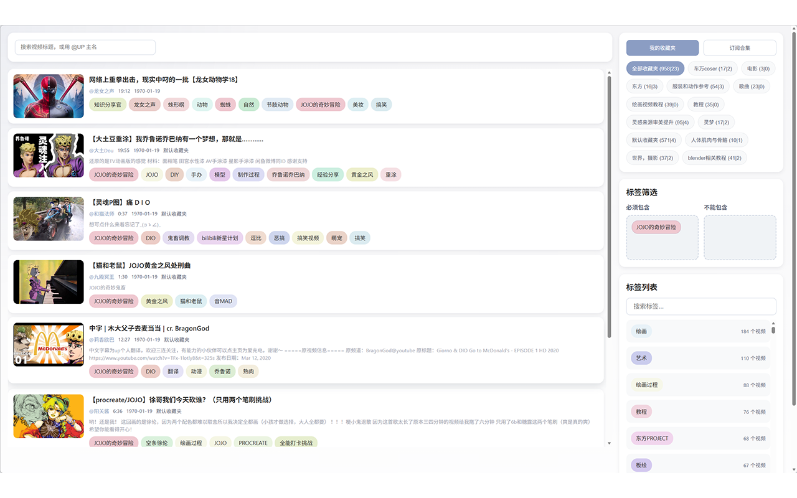

# Bilibili Discovery Engine
## 您的B站内容智能管理与发现助手

Bilibili Discovery Engine是一款强大的浏览器扩展，专为B站用户打造。它帮助您智能管理和探索B站内容，通过自动数据同步、智能分类、观看统计等功能，让您轻松发现和管理感兴趣的UP主和视频。

---

## ✨ 核心功能亮点

### 🔄 自动数据同步 - 零操作，数据始终最新
- **智能关注列表同步**：自动从B站拉取已关注UP主数据，无需手动更新
- **收藏夹自动同步**：自动同步收藏夹视频数据，不错过任何精彩内容
- **无感知数据记录**：观看视频时自动记录相关数据，无需任何手动操作
- **实时数据更新**：保持数据最新，随时掌握最新动态


### 🎯 智能数据记录 - 全方位记录您的观看轨迹
- **UP主信息自动记录**：自动记录UP主名称、头像、签名等详细信息
- **视频信息完整记录**：自动记录视频标题、标签、时长、发布时间等元数据
- **观看行为精准追踪**：自动记录观看时长、观看进度、观看频次等行为数据
- **数据本地存储**：所有数据安全存储在本地，完全由您掌控

### 🔍 强大的搜索与管理 - 快速找到目标内容

#### UP主管理
- **多维度搜索**：支持基于UP主名称、标签、关注状态等多条件组合搜索
- **智能分类**：通过AI自动为UP主进行标签分类，快速找到同类型UP主
- **关注状态管理**：一键查看和管理关注状态，轻松管理关注列表


#### 视频管理
- **精准搜索**：支持基于视频标题、UP主名称、收藏夹、标签等多维度筛选
- **收藏夹管理**：方便地浏览和管理收藏夹中的视频
- **标签筛选**：通过标签快速找到感兴趣的视频类型



### 🎨 个性化主题 - 打造专属视觉体验
- **多套主题配色**：提供莫兰迪等多套精美主题配色方案
- **明暗模式切换**：支持浅色和深色模式自由切换
- **动态主题切换**：切换主题无需刷新页面，即时生效
- **视觉舒适设计**：采用低饱和度、柔和色调，减少视觉疲劳，适合长时间使用


### 🤖 AI智能分类 - 让内容管理更智能
- **智能UP主分类**：基于AI自动分析UP主内容，自动生成标签分类
- **兴趣标签推断**：根据您的观看历史，智能推断您的兴趣偏好
- **个性化推荐**：基于您的兴趣标签和观看行为，推荐可能感兴趣的UP主和视频

### 📊 观看统计分析 - 深度了解您的观看习惯
- **观看时长统计**：详细记录您的观看时长，了解时间分配
- **兴趣分布分析**：可视化展示您的兴趣分布，发现潜在兴趣领域
- **观看趋势追踪**：追踪观看行为变化，了解兴趣演变

---

## 🏗️ 技术架构 - 高性能，高可靠

### 四层架构设计，性能卓越

```
数据采集层 → 数据存储层 → 业务计算层 → 用户界面层
```

#### 1. 数据采集层 - 智能高效
- **三层架构设计**：触发器层、收集器层、转发层各司其职
- **智能触发机制**：精准监听页面事件，在最佳时机收集数据
- **高效数据提取**：从页面快速提取所需数据，不影响页面性能
- **统一数据转发**：采用统一的数据转发接口，确保数据准确传输

#### 2. 数据存储层 - 高性能数据库
- **IndexedDB数据库**：支持海量数据存储，性能稳定可靠
- **分层缓存系统**：
  - 索引缓存：快速定位数据
  - 数据缓存：减少数据库查询
  - 渲染缓存：提升页面渲染速度
- **批量操作优化**：支持批量数据操作，大幅提升数据处理效率
- **智能分页管理**：高效管理大量数据，流畅浏览

#### 3. 业务计算层 - 智能分析
- **AI分类引擎**：基于LLM的智能分类系统，准确识别内容类型
- **兴趣计算模型**：基于观看行为计算兴趣分数，精准匹配内容
- **标签权重系统**：动态调整标签权重，反映兴趣变化

#### 4. 用户界面层 - 流畅体验
- **渲染书系统**：智能缓存渲染结果，大幅提升页面响应速度
- **渲染列表管理**：高效管理大量元素，流畅翻页
- **主题管理系统**：动态主题切换，无需刷新页面
- **响应式设计**：适配各种屏幕尺寸，体验一致

---

## 🚀 性能优势

### ⚡ 极速响应
- **智能缓存机制**：多级缓存系统，常用数据秒级加载
- **增量更新**：仅更新变化数据，减少不必要的操作
- **异步处理**：后台异步处理数据，不阻塞用户操作

### 💾 海量存储
- **IndexedDB支持**：支持存储数万条UP主和视频数据
- **无限制存储**：自动申请存储空间，无需担心容量不足
- **数据压缩**：智能压缩存储数据，节省空间

### 🔒 数据安全
- **本地存储**：所有数据存储在本地浏览器中，不上传任何信息
- **隐私保护**：仅访问B站公开数据，不收集任何个人敏感信息
- **完全掌控**：数据完全由用户控制，可随时清除

---

## 📱 简单易用

### 快速安装
支持Chrome、Edge、Firefox等主流浏览器，只需三步即可完成安装：
1. 下载扩展文件
2. 打开浏览器扩展页面
3. 拖拽安装，立即使用

### 智能设置
- **自动配置**：首次使用时自动引导完成基本设置
- **个性化配置**：支持自定义各种参数，满足个性化需求
- **一键同步**：点击按钮即可同步数据，操作简单


## 💡 为什么选择我们？

### ✅ 完全免费
所有功能完全免费使用，无任何隐藏收费

### ✅ 数据安全
所有数据本地存储，不上传任何信息

### ✅ 持续更新
定期更新和优化，不断增加新功能

### ✅ 开源透明
代码完全开源，欢迎贡献和监督

**Bilibili Discovery Engine** - 让B站内容管理更智能，让内容发现更轻松！
